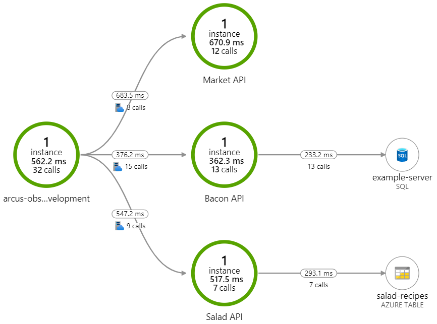

# Arcus - API Gateway POC

POC to integrate Azure API Management with our observability based on `Request-Id` according [W3C Trace-Context](https://www.w3.org/TR/trace-context/).

## Getting Started

Before you can run this, you need to:

1. Provision an Azure API Management instance with a self-hosted gateway
2. Configure the gateway in Docker Compose
3. Create a Bacon API based on the OpenAPI spec of our local API ([url](http://localhost:789/api/docs/index.html))
4. Make Bacon API available locally
5. Run solution with Docker Compose
6. Get bacon by calling the self-hosted gateway - GET http://localhost:700/api/v1/bacon

## Observability

End-to-end correlation from Azure API Management is provided until the database:

## Action items

- [ ] Be more open and extensible in Arcus ([Arcus #143](https://github.com/arcus-azure/arcus/issues/143))
- [ ] Incorporate hacks upstream to be able to interpret, track and use parent id
- [ ] Incorporate hacks upstream allowing users to re-use upstream service operation id and tracking them correspondingly

_Some of the action items can be easily found by searching for `TODO: Contribute Upstream` or using the Task List._

## Clarification Required

- [ ] Should we generate ID's according to W3C (`System.Diagnostics.Activity`)?
- [ ] Why are the correlation options part of Arcus Observability if they are scoped to Web APIs?